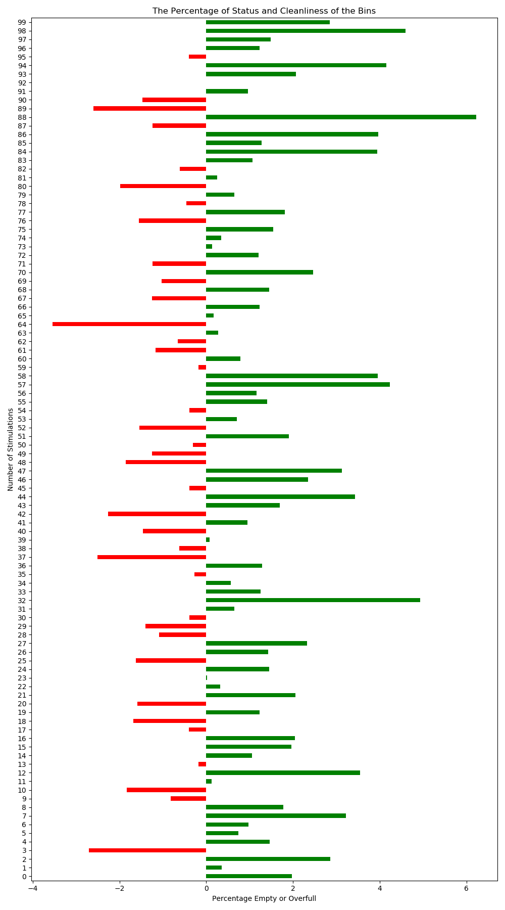
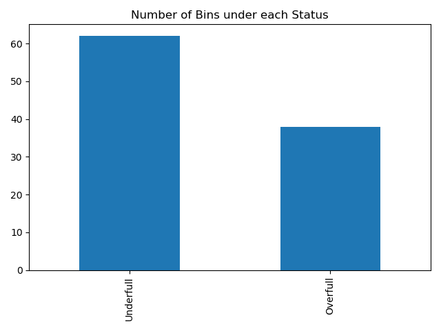
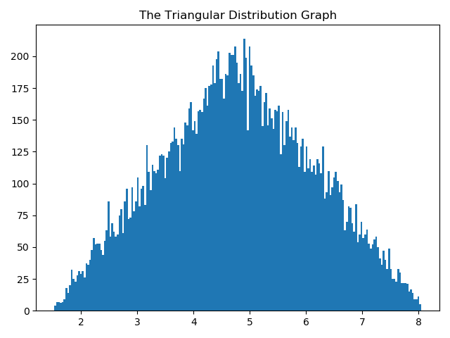

## **Optimization of Resources for Waste Management**

Spring 2020 [IS 590: Progr Analytics & Data Process]

Monte Carlo Simulation technique will be used to calculate the probability of a bin near an apartment complex being full

### **The Idea behind the project?**

Although the waste generation keeps growing especially in developing nations, the situation is not completely hopeless. 
Thanks to the technology, many forward-looking waste management companies are now installing fill-level sensors in their waste containers to detect a full trash can. 
As a result, the companies are saving money on operational waste collection costs while leaving a lighter ecological footprint.

"People should only buy what they need, otherwise they will only be throwing a lot of it away when it all goes out of date"

This project will help in analyzing with given scenarios to understand how we can regulate the number of trash bins as well as weekly collections to optimize resources and manage waste more effectively and promote sanitization.

### **Project Description**

The project illustrates optimizing the resources for waste management. Here we create an apartment complex scenario and see how we can increase sanitation and reduce the investment cost by a substitute of small labor

Hypothesis: If we change from emptying the bins once per week to TWICE per week, we should be able to contain the garbage better (fewer overflows) even while reducing the NUMBER of bins by 40%

#### **References**
http://www.zendergroup.org/docs/container.pdf
https://docs.scipy.org/doc/numpy-1.14.1/reference/generated/numpy.random.triangular.html
